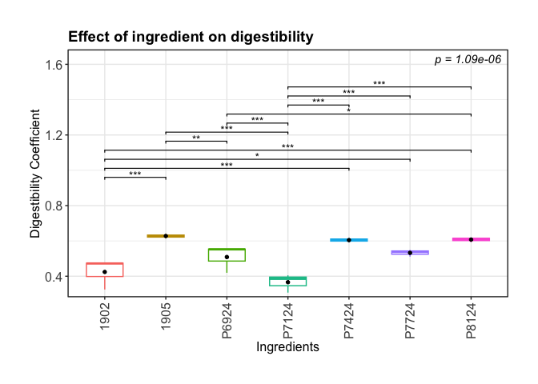

ProteinDigestibilityAnalysisRMarkdown
================
Wendy Liu
2026-08-31

## Calculating Digestibility Coefficients

``` r
DigestibilityData <- read.csv("/Users/wendy/Downloads/Stirling_Digestibility.csv")

Controls = subset(DigestibilityData, DigestibilityData$Type == "Control")

Samples = subset(DigestibilityData, DigestibilityData$Type == "Sample")

# Calculate average Protein_Kjeldahl per Sample.Name in Controls
control_avg = aggregate(Protein_Kjeldahl ~ Sample.Name, data = Controls, FUN = mean)
names(control_avg)[2] = "averageControl"

# Merge that average into the Samples dataframe, matching by Sample.Name
Samples = merge(Samples, control_avg, by = "Sample.Name")

Samples$DigestibilityCoeff = 1- (Samples$Protein_Kjeldahl/Samples$averageControl)
```

## Statistics

Question: Does the ingredient of the feed (Sample.Name) has a
significant impact on the digestibility coefficient (DigestibilityCoeff)
?

DigestibilityCoeff ~ Sample.Name

Digestibility coefficient is measured independently i.e. only after the
HG phase; It is also a continuous proportions (not from discrete
counts), especially with values clustering near 0 or 1.

The first thing we need to check is the normality of the data
contribution

``` r
range(Samples$DigestibilityCoeff, na.rm = TRUE)
```

    ## [1] 0.3073142 0.6400000

``` r
# This confirmed the proportions/percentages are indeed bounded 0-1

res.aov <- aov(DigestibilityCoeff ~ Sample.Name, data = Samples) #ANOVA

plot(res.aov, 2) #QQplot
```

<!-- -->

``` r
aov_residuals <- residuals(object = res.aov) #extract ANOVA residuals
shapiro.test(x = aov_residuals) #run shapiro-wilk test
```

    ## 
    ##  Shapiro-Wilk normality test
    ## 
    ## data:  aov_residuals
    ## W = 0.88654, p-value = 0.01936

``` r
#  p < 0.05 -> residuals significantly deviate from normality


Samples$asin_DC <- asin(sqrt(Samples$DigestibilityCoeff))

res.aov <- aov(asin_DC ~ Sample.Name, data = Samples) #ANOVA
aov_residuals <- residuals(object = res.aov) #extract ANOVA residuals
shapiro.test(x = aov_residuals) #run shapiro-wilk test
```

    ## 
    ##  Shapiro-Wilk normality test
    ## 
    ## data:  aov_residuals
    ## W = 0.88786, p-value = 0.02049

``` r
#  p < 0.05 -> residuals significantly deviate from normality even after data transformation
```

Since our proportional data does not mean the assumptions for a one-way
anlaysis of varianace, we can either:

1.  Use beta regression. It’s built specifically for outcomes bounded in
    (0,1) and doesn’t assume normality. It will give us a test of
    whether your input variable significantly predicts the proportion.

2.  non-parametric comparison between groups The Kruskal-Wallis test Do
    the distributions of several independent groups differ? Rather than
    the analysis of variance (is there a difference in mean),

<!-- -->

1)  Null hypothesis: The outcome has the same distribution in all
    groups.
2)  Alternative hypothesis:The outcome distribution differs for at least
    one group.

Mann-Whitney U test (2 groups) or Kruskal-Wallis test (3+ groups) —
these compare rank distributions and don’t assume normality. Simple and
often sufficient if you just want a “is there a difference” answer
without modeling mechanics.

## 1. Beta regression

``` r
library(glmmTMB)
library(lmtest)
```

    ## Loading required package: zoo

    ## 
    ## Attaching package: 'zoo'

    ## The following objects are masked from 'package:base':
    ## 
    ##     as.Date, as.Date.numeric

``` r
# we can also test whether there is a batch effect the Date: 
model_1 <- glmmTMB(DigestibilityCoeff ~ Sample.Name,
                 data = Samples,
                 family = beta_family(link = "logit"))

Samples$Date <- as.factor(Samples$Date)

model_2 <- glmmTMB(DigestibilityCoeff ~ Sample.Name + (1| Date),
                 data = Samples,
                 family = beta_family(link = "logit"))

lrtest(model_1, model_2)
```

    ## Likelihood ratio test
    ## 
    ## Model 1: DigestibilityCoeff ~ Sample.Name
    ## Model 2: DigestibilityCoeff ~ Sample.Name + (1 | Date)
    ##   #Df LogLik Df Chisq Pr(>Chisq)
    ## 1   8 37.724                    
    ## 2   9 37.724  1     0     0.9999

As p \> 0.05, the liklyhood ratio test suggested that adding the random
effect for Date made no difference at all to the model fit.

As such we are going for the model, model_1, without adding the random
effect for Date

``` r
null_model <- glmmTMB(DigestibilityCoeff ~ 1,
                       data = Samples,
                       family = beta_family(link = "logit"))

lrtest(model_1, null_model)
```

    ## Likelihood ratio test
    ## 
    ## Model 1: DigestibilityCoeff ~ Sample.Name
    ## Model 2: DigestibilityCoeff ~ 1
    ##   #Df LogLik Df  Chisq Pr(>Chisq)    
    ## 1   8 37.724                         
    ## 2   2 18.690 -6 38.068   1.09e-06 ***
    ## ---
    ## Signif. codes:  0 '***' 0.001 '**' 0.01 '*' 0.05 '.' 0.1 ' ' 1

``` r
anova(null_model, model_1) # its the same thing as lrtest
```

    ## Data: Samples
    ## Models:
    ## null_model: DigestibilityCoeff ~ 1, zi=~0, disp=~1
    ## model_1: DigestibilityCoeff ~ Sample.Name, zi=~0, disp=~1
    ##            Df     AIC     BIC logLik deviance  Chisq Chi Df Pr(>Chisq)    
    ## null_model  2 -33.379 -31.290 18.690  -37.379                             
    ## model_1     8 -59.447 -51.091 37.724  -75.447 38.068      6   1.09e-06 ***
    ## ---
    ## Signif. codes:  0 '***' 0.001 '**' 0.01 '*' 0.05 '.' 0.1 ' ' 1

since p = 1.09e-06 (p\<0.05), this confirms that there is a significant
effect of treatment somewhere among the groups.

## beta regression follow up: Pairwise comparisons

to see which specific treatments differ from each other

``` r
library(emmeans)
```

    ## Welcome to emmeans.
    ## Caution: You lose important information if you filter this package's results.
    ## See '? untidy'

``` r
results = emmeans(model_1, pairwise ~ Sample.Name, type = "response")

# estimated mean digestibility per treatment

results$emmeans
```

    ##  Sample.Name response     SE  df asymp.LCL asymp.UCL
    ##  1902           0.423 0.0233 Inf     0.378     0.469
    ##  1905           0.627 0.0228 Inf     0.581     0.670
    ##  P6924          0.509 0.0236 Inf     0.463     0.555
    ##  P7124          0.366 0.0227 Inf     0.322     0.411
    ##  P7424          0.604 0.0231 Inf     0.558     0.648
    ##  P7724          0.532 0.0236 Inf     0.486     0.578
    ##  P8124          0.607 0.0231 Inf     0.561     0.651
    ## 
    ## Confidence level used: 0.95 
    ## Intervals are back-transformed from the logit scale

``` r
# This gives us the back-transformed (proportion-scale) estimated digestibility coefficient for each treatment, with 95% confidence intervals:

# Response

# Extract the contrasts part and convert to a data frame
contrasts_df <- as.data.frame(results$contrasts)

# View it
contrasts_df
```

    ##  contrast      odds.ratio        SE  df null z.ratio p.value
    ##  1902 / 1905    0.4358675 0.0595708 Inf    1  -6.076  <.0001
    ##  1902 / P6924   0.7071317 0.0950655 Inf    1  -2.578  0.1328
    ##  1902 / P7124   1.2697213 0.1738814 Inf    1   1.744  0.5864
    ##  1902 / P7424   0.4801846 0.0652602 Inf    1  -5.398  <.0001
    ##  1902 / P7724   0.6433524 0.0865739 Inf    1  -3.278  0.0181
    ##  1902 / P8124   0.4744899 0.0645268 Inf    1  -5.482  <.0001
    ##  1905 / P6924   1.6223545 0.2204518 Inf    1   3.561  0.0068
    ##  1905 / P7124   2.9130900 0.4031149 Inf    1   7.727  <.0001
    ##  1905 / P7424   1.1016757 0.1512887 Inf    1   0.705  0.9923
    ##  1905 / P7724   1.4760275 0.2007524 Inf    1   2.863  0.0637
    ##  1905 / P8124   1.0886103 0.1495862 Inf    1   0.618  0.9963
    ##  P6924 / P7124  1.7955939 0.2445074 Inf    1   4.299  0.0003
    ##  P6924 / P7424  0.6790597 0.0917514 Inf    1  -2.865  0.0633
    ##  P6924 / P7724  0.9098057 0.1217059 Inf    1  -0.707  0.9923
    ##  P6924 / P8124  0.6710064 0.0907209 Inf    1  -2.951  0.0496
    ##  P7124 / P7424  0.3781811 0.0520468 Inf    1  -7.066  <.0001
    ##  P7124 / P7724  0.5066879 0.0690608 Inf    1  -4.988  <.0001
    ##  P7124 / P8124  0.3736961 0.0514611 Inf    1  -7.148  <.0001
    ##  P7424 / P7724  1.3398022 0.1811964 Inf    1   2.163  0.3159
    ##  P7424 / P8124  0.9881405 0.1350311 Inf    1  -0.087  1.0000
    ##  P7724 / P8124  0.7375271 0.0998072 Inf    1  -2.250  0.2690
    ## 
    ## P value adjustment: tukey method for comparing a family of 7 estimates 
    ## Tests are performed on the log odds ratio scale

## Plots

``` r
library(ggplot2)
library(ggpubr)
```

    ## Warning: package 'ggpubr' was built under R version 4.4.3

``` r
library(dplyr)
library(tidyr)

# 1. Prepare overall model p-value (from LRT)
p_values <- data.frame(
  label = paste0("p = ", signif(1.09e-06, 3))
)

# 2. Prepare pairwise contrasts for plotting
# Split "contrast" column (e.g. "1902 / 1905") into group1/group2
pairwise_p_values <- contrasts_df %>%
  separate(contrast, into = c("group1", "group2"), sep = " / ") %>%
  filter(p.value < 0.05) %>%   # keep only significant comparisons to avoid clutter
  mutate(
    label = case_when(
      p.value < 0.001 ~ "***",
      p.value < 0.01  ~ "**",
      p.value < 0.05  ~ "*",
      TRUE ~ "ns"
    )
  )

# 3. Set y.position for brackets (stack them above the data)
max_y <- max(Samples$DigestibilityCoeff, na.rm = TRUE)
pairwise_p_values$y.position <- seq(
  from = max_y * 1.5,
  by = max_y * 0.08,   # spacing between stacked brackets
  length.out = nrow(pairwise_p_values)
)

# 4. Plot
p <- ggplot(
  Samples,
  aes(x = Sample.Name, y = DigestibilityCoeff)
) +
  geom_boxplot(
    width = 0.6,
    aes(colour = Sample.Name)
  ) +
  stat_summary(
    fun = mean,
    geom = "point",
    shape = 20,
    size = 2,
    colour = "black",
    aes(group = Sample.Name)
  ) +

  # Overall model p-value
  geom_text(
    data = p_values,
    aes(x = Inf, y = Inf, label = label),
    inherit.aes = FALSE,
    hjust = 1.1,
    vjust = 1.5,
    fontface = "italic",
    colour = "black"
  ) +

  # Pairwise significant comparisons
  stat_pvalue_manual(
    pairwise_p_values,
    label = "label",
    xmin = "group1",
    xmax = "group2",
    y.position = "y.position",
    tip.length = 0.01,
    bracket.size = 0.4,
    size = 3.5,
    inherit.aes = FALSE
  ) +

  coord_cartesian(clip = "off") +
  scale_y_continuous(
    expand = expansion(mult = c(0.02, 0.18))
  ) +
  theme_bw() +
  labs(
    x = "Ingredients",
    y = "Digestibility Coefficient",
    title = "Effect of ingredient on digestibility"
  ) +
  theme(
    plot.title = element_text(size = 14, face = "bold"),
    axis.text = element_text(size = 12),
    axis.title = element_text(size = 12, face = "plain"),
    axis.text.x = element_text(
      angle = 90,
      vjust = 0.5,
      hjust = 1
    ),
    plot.margin = unit(c(1, 1, 1, 1), units = "cm")
  ) + 
  theme(legend.position = "none")

p
```

<!-- -->
\## To be continue…. \## Kruskal-Wallis test

see this page The Kruskal-Wallis test (also called H-test) is a
non-parametric statistical test used to compare three or more
independent groups to determine whether their distributions differ. The
Kruskal-Wallis test extends the Mann-Whitney U test to more than two
independent groups.

The Kruskal-Wallis test is used when the assumptions for a one-way
analysis of variance are not met. Because the Kruskal-Wallis test is a
non-parametric test, the data used do not have to be normally
distributed.

The data must at least have an ordinal scale level and the samples must
be independent.

\`
